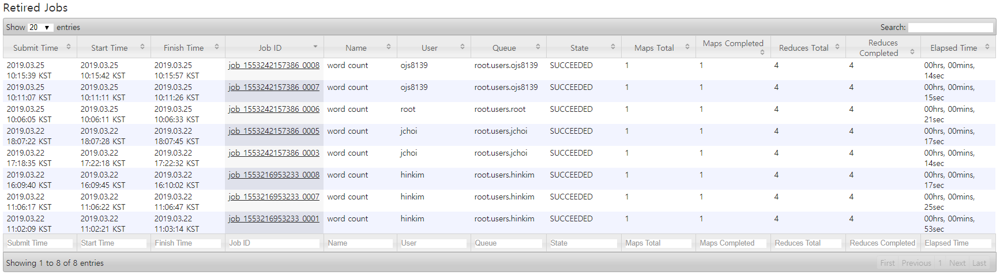
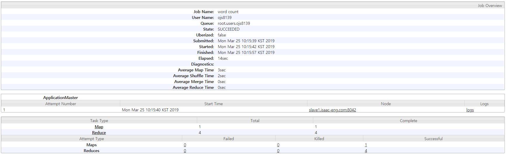
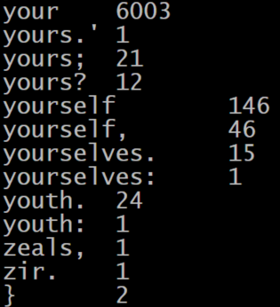
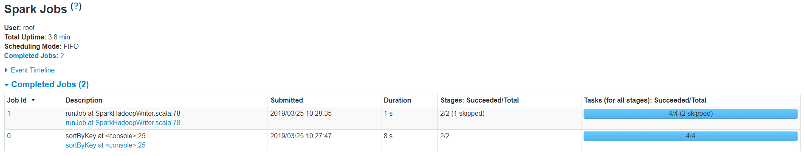
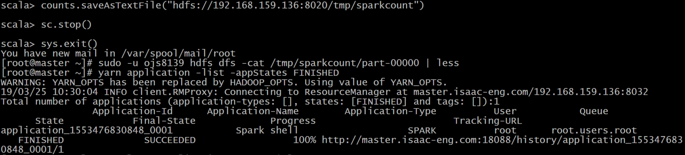
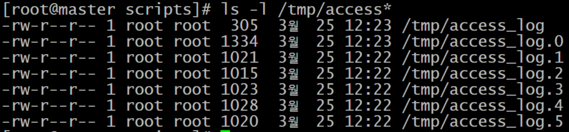
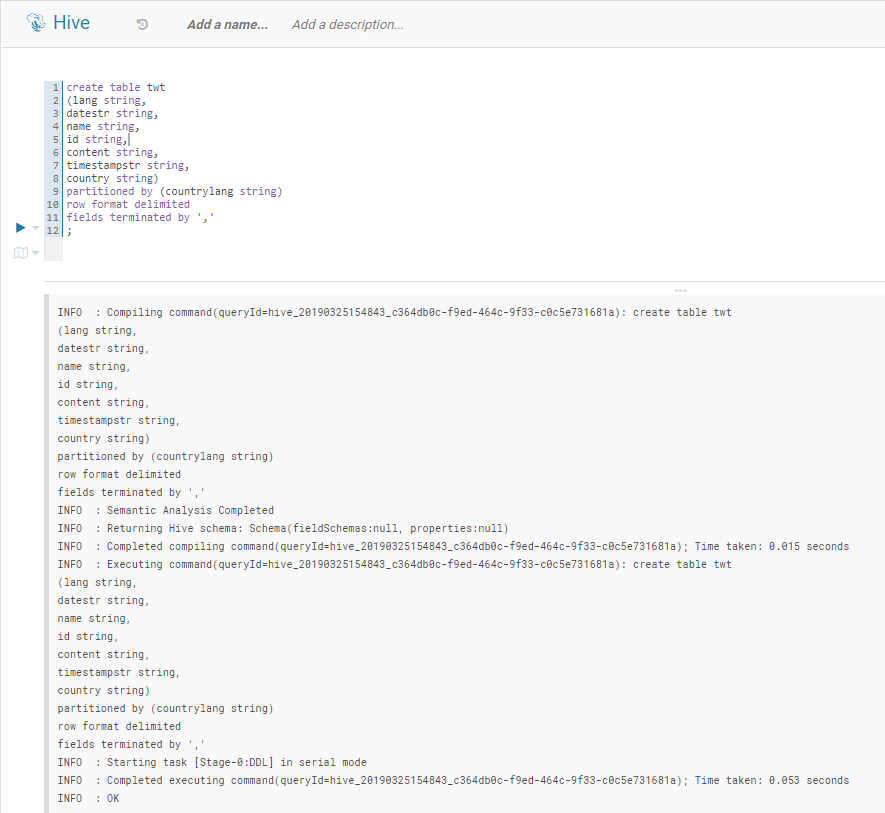
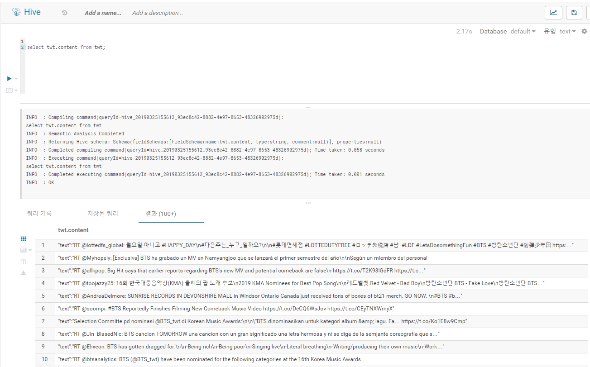
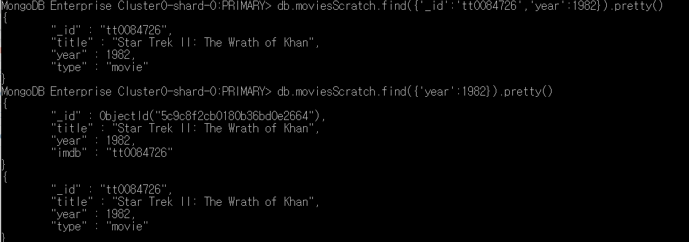

# Week4

## Hands-On-Exercise: Running YARN Applications
### MapReduce example 파일을 wordcount 해보기
맵리듀스 jar 예제 파일을 실행하여 wordcount 실행
```
 $ hadoop jar /opt/cloudera/parcels/CDH/lib/hadoop-mapreduce/hadoop-mapreduce-examples.jar wordcount /tmp/shakespeare.txt counts 
```
### 결과 화면




### 스파크 실행 후 디버그 및 로그 파일 보기
여기 나중에 다시 수정

### 수행 과정
```
$ yarn application -list -appStates FINISHED 
```
### 결과 화면


---
## Hands-On Exercise: Explore Hadoop Configurations and Daemon Logs
### 결과 화면


## Hands-On Exercise: Importing Data with Sqoop
### Import DATA FROM LOCAL TO HDFS
```
$ sudo -u ojs8139 hadoop fs -copyFromLocal -f /user/ojs8139/sqoop/twtrawdata /user/ojs8139
```
### Import data from hdfs to hive
#### CREATE HIVE TABLE


#### LOAD DATA FROM HDFS FROM HIVE
```
hive> LOAD DATA INPATH '/user/ojs8139/twtrawdata' into TABLE twt PARTITION(countrylang='us')
```

### SELECT VALUE IN THE HIVE TABLE


get_json_object(json_txt, path) 

# mongoDB
