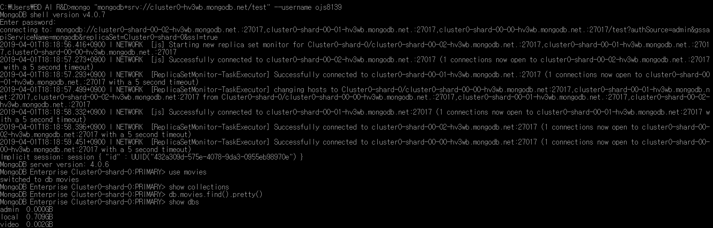
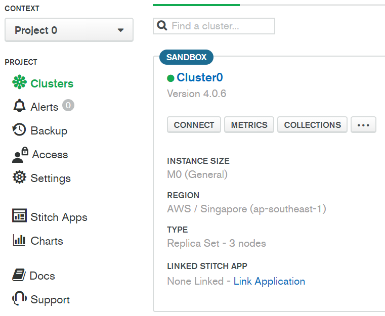
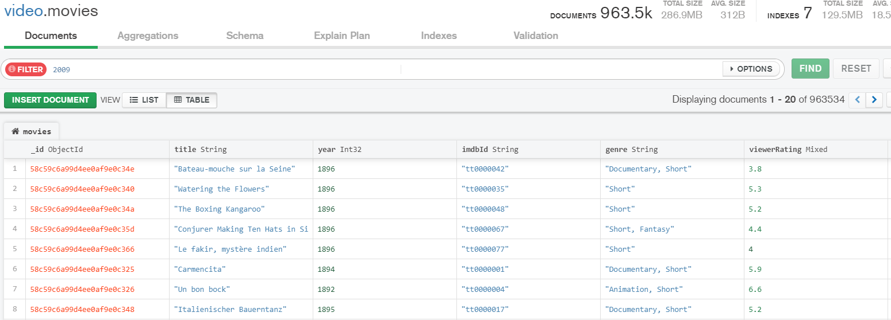

# Week4

## Hands-On-Exercise: Running YARN Applications
### MapReduce example 파일을 wordcount 해보기
맵리듀스 jar 예제 파일을 실행하여 wordcount 실행
```
 $ hadoop jar /opt/cloudera/parcels/CDH/lib/hadoop-mapreduce/hadoop-mapreduce-examples.jar wordcount /tmp/shakespeare.txt counts 
```
### 결과 화면


### 스파크 실행 후 디버그 및 로그 파일 보기
여기 나중에 다시 수정

### 수행 과정
```
$ yarn application -list -appStates FINISHED 
```
### 결과 화면


---
## Hands-On Exercise: Explore Hadoop Configurations and Daemon Logs
### 결과 화면


## Hands-On Exercise: Importing Data with Sqoop
### Import DATA FROM LOCAL TO HDFS
```
$ sudo -u ojs8139 hadoop fs -copyFromLocal -f /user/ojs8139/sqoop/twtrawdata /user/ojs8139
```
### Import data from hdfs to hive
#### CREATE HIVE TABLE


#### LOAD DATA FROM HDFS FROM HIVE
```
hive> LOAD DATA INPATH '/user/ojs8139/twtrawdata' into TABLE twt PARTITION(countrylang='us')
```

### SELECT VALUE IN THE HIVE TABLE


get_json_object(json_txt, path) 

# mongoDB

## mongoDB  접속 화면

## CLI 화면


## Web UI 화면


## Lecture 계정


## 기술세미나 발표 후 피드백 결과
1. Sqoop을 사용하는 객체는 무엇인가?
* Sqoop Client tool
    - Sqoop은 CLI 등으로 이용하는 방법이 있다.
* Custom java App
    - Sqoop에서 받은 명령을 서버에서 제공하는 자바 가상머신에서 실행된다.
* Web Browser
    - Hue의 Sqoop query Web UI 화면에서 Sqoop를 이용할 수 있다.

2. mysql에 접속이 되지 않는 이유
* OS에 사용자 정보가 없었다.(root만 있고 접속은 다른 이름으로 하려고 하여 Permission Denied 에러가 뜸)
* Sqoop으로 HDFS에 저장하는 과정에서 HDFS에 접속하는데 접속 아이디를 명시하지 않음. 해당 에러를 해결하기 위해서는 HDFS supergroup 아이디를 만들거나, export HDFS_USERNAME=ojs8139를 커멘드 라인 가장 앞에 명시하여 한시적으로 접속 가능

3. Hive FIle Format
* ORC(Optimized Row Columnar)<br>
칼럼 단위로 데이터를 기록하고, 인덱스를 기록하여 컬럼에 바로 접근할 수 있기 때문에 속도가 빠르다.
---

### parquet
파케이(Parquet)는 중첩된 데이터를 효율적으로 저장할 수 있는 
#### 컬럼 기준 저장 포맷
컬럼 기준 포맷은 파일 크기와 쿼리 성능 측면에 모두 효율성이 높음

동일한 컬럼 값을 나란히 모아서 저장 –> 인코딩 효율이 높음
일반적으로 행 기반 포맷에 비해 파일 사이즈가 작음. 쿼리 성능 높음
#### 장점

* 진정한 컬럼 기반 방식으로 중첩 구조(Nested data structure)의 데이터를 저장할 수 있다는 것
    * 적은 오버헤드로 단층 컬럼 기준 포맷에 중첩된 구조를 저장하는 새로운 기술
    * 파케이는 중첩된 필드를 다른 필드와 상관 없이 독립적으로 읽을 수 있게 되었으며 따라서 상당한 성능 향상을 얻을 수 있었음
* Parquet 포맷을 지원하는 수많은 도구가 있다는 것
    * 이러한 유연성은 인메모리 표현까지 확장
    * 자바 구현체는 단일 표현에 얽매이지 않기 때문에 파케이 파일에서 데이터를 읽고 쓰는데 에이브로, 쓰리프트, 프로토콜 버퍼의 인메모리 데이터 모델을 사용할 수 있음
### 데이터 모델
#### 기본 자료형
```
boolean, int32/64/96, float, double, binary, fixed_len_byte_Array
```
기본 문자열 자료형이 없다는 점 주의. 대신 기본 자료형에 대한 해석 방식을 정의한 논리 자료형을 제공. 따라서 직렬화 표현(기본 자료형)과 애플리케이션에 특화된 시맨틱(논리 자료형)은 차이가 있음. 문자열은 UTF-8 어노테이션을 가진 binary 기본 자료형으로 표현

#### 논리 자료형
```
UTF8, ENUM, DECIMAL, DATE, LIST(순서 있는 값의 집합), MAP(순서 없는 키-값 쌍의 집합)<br>
LIST, MAP은 두 단계 그룹 구조의 그룹으로 만든다.
```
#### 중첩 인코딩
* 스키마의 모든 기본 자료형 필드의 값을 별도의 컬럼에 저장하고, 그 구조는 명세 수준과 반복 수준의 두 정수로 인코딩한다.
* 단층 레코드는 null을 사용하고 중첩이나 반복 수준이 올라가면 null이 아닌 값을 사용해서 비트 필드를 인코딩한다고 생각하면 됨
* 이러한 인코딩 방식을 이용하면 중첩 컬럼을 포하만 어떤 컬럼도 다른 컬럼과 상관없이 읽을 수 있다. 키만 읽을 수도 있음
---
* Text FIle<br>
텍스트 형식으로 저장하는 방법
* csv<br>
Comma-seperated values 필드를 쉼표(,)로 구분한 텍스트 포맷
* json<br>
JavaScript Object Notation 으로 가벼운 DATA 교환 형식으로, 사람이 읽고 쓰기 쉽고, 기계도 분석하기 쉽게 만들어진 포맷이다.
기본적으로 key, value로 구성되어 있다.