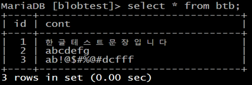
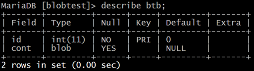
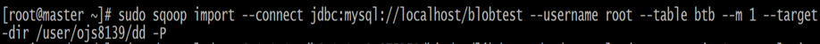
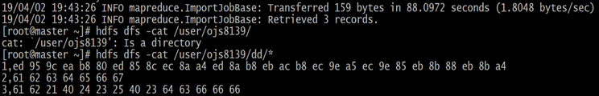
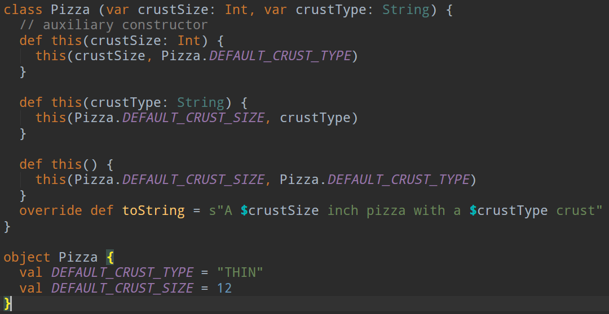
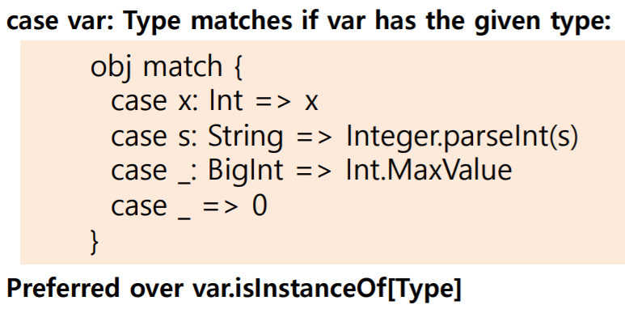
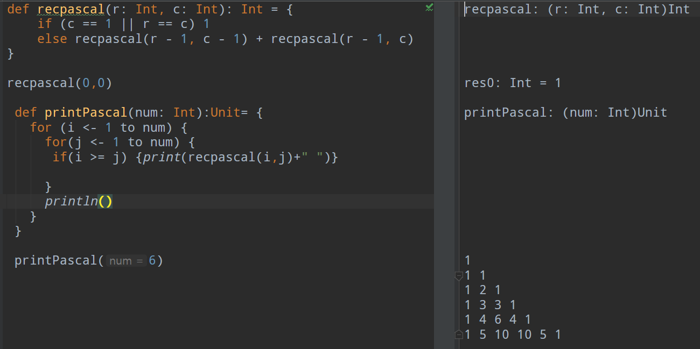

# Week5

## Sqoop BLOB data import to HDFS 방법 조사
### CLOB
* 사이즈가 큰 데이터를 DB 외부에 저장하기 위한 데이터 타입
* SQL문에서 문자열 타입으로 출력 값이 표현된다.
* CLOB 타입 값을 문자열 값으로 변환하는 경우, 문자열 크기는 1GB를 넘을 수 없다.
* 반대로 문자열을 CLOB 타입으로 변환하는 경우, CLOB 저장소 제공 최대 파일 크기를 넘을 수 없다.

### BLOB
* 바이너리 데이터(비디오, 사진 등)를 DB 외부에 저장하기 위한 타입
* SQL문에서 비트열 타입으로 출력 값이 표현된다.
BLOB 타입 값을 바이너리 값으로 변환하는 경우, 크기는 1GB를 넘을 수 없다.
반대로 문자열을 BLOB 타입으로 변환하는 경우, BLOB 저장소 제공 최대 파일 크기를 넘을 수 없다.

### BLOB 데이터 HDFS로 IMPORT
* mysql에 BLOB 컬럼 포함 테이블 구성



* 데이터를 저장하는 것은 문제가 없으나 인코딩 문제가 발생



#### 해결책
1. 해당 데이터는 mysql에 데이터를 직접 저장하고 있다. 하지만 최근 BLOB형식의 데이터는 데이터를 저장하는 로컬 PC를 두고, 데이터 위치를 저장하여 데이터를 관리하는 방식을 택한다.

2. DB에 데이터를 저장할 때 인코딩을 하여 저장한다. 인코딩 한 후 데이터를 Hive나 기타 hadoop DB로 불러올 시 어떤 식으로 불러오는지 아직 확인 미수행

3. Hive에서 인코딩을 하면서 불러와 보니, 데이터가 깨지는 것을 확인할 수 있었다.


---
## Scala
side-effects를 없애기 위해서는 Immutable State로 짜여져야 한다.

### Functional Programming 기능<br>
각 각 병렬처리 하여 데이터를 Immutable 하게 만들어 준다.

## Scala 기본

* object-oriented and functional
* JVM 위에서 구동하며 java heap space 안에서 돈다. 자바 모든 라이브러리 사용 가능하다. 
* 현재 JAVA는 너무 많은 기능이 들어가 있어서 관리가 힘든데, 이런 부가 기능들 중 정말 중요한
것을 제외하고 초기 JAVA 기능에 중점을 두고 있다.
* MAP으로 매핑을 하는데, 어떠한 형식으로 매핑하여도 가능하다.(scalable)
* Scala에선 모든 것이 객체이다.(어떤 객체든.mathod 사용 가능)

### Scala 설치 조건
* jdk 1.8 이상

## REPL(Read Execute Print Loop)
화면에서 곧 바로 결과물을 볼 수 있는 환경

## Scala 변수, 상수, 타입
* val 타입은 스칼라에서 상수라는 표현보다는 immutable value라고 표현하는게 더 스칼라 다운 표현이다.
* val 과 var 구분해서 이해해야 한다. var 은 변수이다.
* Unit 은 Void와 비슷한 개념
    
Int와 int의 차이
```
java basic 코딩은 int로, 스칼라는 Int로 쓰인다.
```

## 함수와 메소드
스칼라에서는 메소드를 없애라고 권장한다. 그 이유는 뒤에 나온다.

### 스칼라 Doc
```
https://www.scala-lang.org/files/archive/api/current/
```

### Notation 구조 설명
char형 p를 받아서 Boolean 타입의 결과를 내는 count 함수, count 함수는 Int 형이다.
```
def count(p: (Char) => Boolean): Int
```

### 중급 난이도 내용(나중에 학습할 것)
```
def scan[B >: Char, That](z: B)(op: (B, B) ⇒ B)(implicit cbf: CanBuildFrom[String, B, That]): That 
```

## 제어구조
* val 선언 시 {} 안의 마지막 행의 결과값이 return 값이 된다.
* 스칼라 사용시, while은 최대한 사용하지 말라고 권유한다.

### For Loops
```
for (i <- 1 to n)
for (i <- 1 to 3; j <- 1 to 3) print((10 * i + j) + " ")
for (i <- 1 to 10) yield i % 3
```
#### yield
For loop에서 결과값을 collection할 때 yield를 사용한다. 

#### guard
for loop에 if 문을 넣으면 어떠한 테스트를 할 수 있다.

#### 위 두 개념은 For loop에서 자주 나오는 개념이니 꼭 숙지할 것

## 함수정의
* indentation이 의미가 없다.
* 회귀 함수인 경우, 함수의 type을 반드시 명시해줘야 한다.
* =, {} 등 범위나 값을 함수 값으로 정의할 수 있다.

```
val s = sum(1 to 5: _*)
```
1,2,3,4,5를 더한 값을 s에 넣는 코드

#### _의 의미
어떤 컬렉션이 있다면 그 안의 모든 것을 모두 꺼내어 제어하는 것

## Arrays, Maps and Tuples

### Array

```
val nums = new Array[Int](10)
```
val a = Array("hello","World") == val a = Array.apply("Hello","World")

#### Array 검색 방법 2가지
* for (element <- a)
* for (i <- 0 until a.length)
* For loop에서 until은 a.length-1까지 검색한다는 의미이다.

#### 배열 동적할당\
b를 가리키는 포인터는 immutable, 내용은 mutable
```
import scala.collection.mutable.ArrayBuffer val b = new ArrayBuffer[Int]
```

#### cast
b.toArray >> 칸을 만들어서 사용<br>
b.toBuffer >> 크기를 조절하여 사용

ArrayBuffer : 크기 조정 가능, 내용물 변경 가능
Array : 크기 조정 불가능, 내용물 변경 가능

### Maps
Construct from key/value pairs
```
val scores = Map("Alice" -> 10, "Bob" -> 3, "Cindy" -> 8)
```

Access values with ()
```
val bobsScore = scores.getOrElse("Bob", 0)
```
```
scores.keySet
scores.values
```
immutable Map은 같은 값이 들어오면 새로운 맵을 생성하여 저장한다.

### Tuples
```
val t = (1, 3.14, "Fred") // An instance of (Int, Double, java.lang.String)
```

_는 어떤 것이 와도 상관없다는 의미
```
val (_, second, third) = t
```

## spark에서는 족보라는 개념이 있다.
immutable strcture가 잇다고 하면 각 스트럭쳐들 간의 의존성이 있다. 그렇다면 immutable map에서 값 update가 생기면 새로운 map이 생기는데, 이러면 의존성이 깨진다. 하지만 스파크에서는 삭제한 map이 필요하다면 의존성이 있던 것으로 올라가서 삭제된 맵을 다시 생성한다.

## Classes and Objects

### Class
scala는 getter, setter를 한해도 클래스 객체를 생성하여 .객체명을 하면 불러올 수 있다.

#### auxiliary constructor
생성자 기능을 한다.

### Objects
Objects 는 보통 singleton으로 봐도 된다. 각자의 정보들이 들어 있다.
companion object : special class, singleton이라고 생각하면 된다. 여기서 코드 생성 시, 클래스와 같은 이름을 넣어줘야 한다.
* java singleton : class로 객체를 생성할 때, 딱 하나만 존재하는 오브잭트 하나를 생성하여 다른 객체들을 관리할 수 있게 한다.
* companion object를 사용하는 이유
```
스칼라는 자바와 다르게 static 키워드가 없다. 대신 비슷하게 클래스와 같은 이름의 object를 선언하여 사용한다. 이러한 object를 companion object라고 한다.
```

>> companion object - companion class는 같은 클래스를 인스턴스 부분과 static 부분으로 분리해둔 것

## Packages, Inheritance, Traits

### Packages
* 패키지는 nesting 가능
* In java, 폴더 dir, location이 중요하지만, 스칼라에서는 한 파일안에 있어도 된다.
* Import 시 맨 하위만 불러와도 가능
```
import java.util.Date
val now = new Date // shortcut for new java.util.Date
```
* _ 를 사용하여 불러오기 가능
```
import java.util._
import java.lang.Math._
```
* 임포드 시 사용 가능한 기능들
```
import java.awt.{Color, Font} // import two classes
import java.util.{HashMap => JavaHashMap} // alias
import java.util.{HashMap => _, _} // hide a class
```

### 상속(Inheritance)
```
class Manager extends Employee
```
#### § Superclass construction
```
class Employee(name: String, age: Int, val salary: Double) extends Person(name, age)
```

### Traits(자바 인터페이스 기능)
* Scala 는 interface 가 없으며 대신  trait 을 사용한다. 
* Scala 의 trait 는 자바의 interface 와 달리 구현 가능하다. (자바8 부터는 자바인터페이스도 디폴트메소드등 구현)
* 하나의 부모클래스를 갖는 클래스의 상속과 달리 트레이트는 몇개라도 조합해 사용 가능하다. 
* Scala 의 traits는 자바의 인터페이스와 추상클래스의 장점을 섞었다. 
* traits를 Mixin 할때는 extends 키워드를 이용한다. 
* extends 를 사용하면 trait 의 슈퍼클래스를 암시적으로 상속하고 , 본래 trait를 Mixin한다.(아이스크림 가게 coldstone 떠올리면 된다.)
* trait 는 어떤 슈퍼클래스를 명시적으로 상속한 클래스에 혼합할 수 있다. 
그때 슈퍼클래스는 extends 를 사용하고, traits는 with 로 믹스인한다.
* with 시 순서도 소스에 영향이 있으니 주의해야 한다.

#### Mixin
```
새로운 클래스를 정의할 때, 부모 클래스의 맴버를 재정의 하여 사용하는 방식
```

## Functional Programming
* 함수는 부를 수 있고, 저장할 수 있고, 다른 함수에 전달할 수 있다.

### Anonymous Functions(익명함수)
```스파크에서 많이 사용되는 함수```
```
def valueAtOneQuarter(f: (Double) => Double) = f(0.25)
>> Double을 인자로 받아서 Double 형태의 return 값을 내 놓음. f에 0.25를 넣어준다.
```

```
def mulBy(factor: Double) = (x:Double) => factor * x
>> mulBy는 인자를 받아 *x를 하는데, 그 다음 함수에 함수 자체를 넘겨준다.
>> 인자(인자, 결과) => 결과(인자, 결과)로 보면(화살표를 기준으로) 해석하기 쉽다.
```

#### 함수 간결화 단계
valueAtOneQuarter((x) => 3 * x)

valueAtOneQuarter((x: Double) => 3 * x)

valueAtOneQuarter(x => 3 * x)

valueAtOneQuarter(3 * _)

>> 변수가 한 개가 있어야 하고, 그 변수가 한 군대에만 쓰여야만 이러한 간결화가 된다.

### Map, Filter, Reduce
* filter는 맵같은데 조건식이 있고, 이 결과 값을 guard하는 역할을 한다.
* ReduceLeft
```
(1 to 9).reduceLeft(_ * _) // (...((1 * 2) * 3) * ... * 9)
>> 1부터9까지 곱하는 기능
```

### Closures
scope가 멀리 떨어져 있음에도 서로 영향을 주는 것

### Currying
```
여러개의 인자를 가진 함수를 호출 할 경우, 파라미터의 수보다 적은 수의 파라미터를 인자로 받으면 누락된 파라미터를 인자로 받는 기법
```

currying 중 _(underline)은 가장 맨 나중에 사용하는 것이다. 이유는 단계마다 파라미터가 인자로 바뀌는데, 중간에 이러한 과정이 잘려버리면 전체 currying이 깨져버리기 때문에.

## Pattern Matching & Case Class
### Match
다른 언어의 switch와 비슷한 기능.

### 변수 패턴
```
import scala.math._
x match {
case Pi => ...
...
}
```
위의 예에선 Pi는 math의 상수인지, 내가 정한 변수인지 알 수 없다. 이를 구분하기 위해서 변수는 소문자로 쓴다. 대부분의 패키지 내부 상수나 변수들은 대문자로 이루어져 있다.

### 타입 체크하는 로직

isInstanceOf 를 쓰는 것보다 더 구체적으로 체크할 수 있으니 해당 코드를 사용하자.

### case class
abstract class 생성하고, 그 클래스를 extends 시키는게 일반적. 생성하면 match에서 바로 사용할 수 있다.
```
abstract class Amount
case class Dollar(value: Double) extends Amount
case class Currency(value: Double, unit: String) extends Amount
case object Nothing extends Amount
```

### Option
값이 있거나 없거나 상태를 나타낼 수 있는 타입
```
true -> Some[T]
false -> None
```

### Final Test

