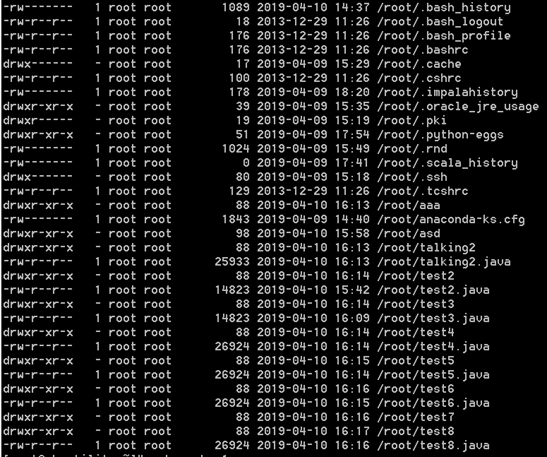

# Week6
## Sqoop Import 과정 테스트

## 2019/04/08
대용량(최소 100G)의 데이터를 Sqoop을 통해 import 하는 과정 중 속도 문제 개선
### MariaDB 가상머신 환경 구축
1. 내부 네트워크 구성 후 MariaDB 전용 가상머신 구축
2. 가상 머신 내 MariaDB 설치

### Oracle 환경 구축
* 내부 네트워크 구성 후 Oracle 전용 가상머신 구축

### MariaDB 내 1.5G 테이블 생성

### Sqoop to HDFS 속도 문제 개선 Search

## 2019/04/09
대용량(최소 100G)의 데이터를 Sqoop을 통해 import 하는 과정 중 속도 문제 개선
### Oracle 환경 구축
* 사무실 개인 PC 이용 Oracle 환경 구축
* Oracle 1.5G 테이블 생성
* MariaDB 1.5G 테이블 생성 및 Sqoop 속도 테스트
* Sqoop to HDFS 속도 문제 개선 Search

## 2019/04/10
#### Sqoop to HDFS 속도 문제 개선 Search
### MariaDB
#### Import 속도 테스트
#### File Size : 1.5G : 평균 소요 시간 10분 내외
* 테스트 횟수 : 10번
* 사용 파라미터 : direct<br>

#### File Size : 4.5G : 평균 소요 시간 8분 내외
* 테스트 횟수 : 2번
* 사용 파라미터 : direct, import-all-tables<br>

#### Sqoop to HDFS 속도 문제 개선 Search

### ORACLE
* 생성 중 /var 폴더에 DB 저장소 설정하여 용량 과부하
    * 다른 사무실 개인PC(오준석 사원)에 DB 재설치

## 2019/04/11
#### Sqoop to HDFS 속도 문제 개선 Search
### MariaDB
* Import 속도 테스트
### ORACLE
* 테이블 생성 및 속도 테스트
* 이전 파일 dump
* 테이블 생성

## 2019/04/12
### ORACLE
* CLOB Type 컬럼 포함 테이블 Import 속도 개선

## 2019/04/13
### Distcp test
iptables -I INPUT 1 -p tcp <IP> --dport 5900 -j ACCEPT 
>> INPUT/OUT 으로 인바운드 아웃바운드 설정<br>
>> 5900 포트로 들어오는 것을 허용하겠다는 커멘드

출처: <http://www.veng.co.kr/?mod=document&uid=11&page_id=732> 

### Oracle to hadoop import kerberos auth


## Oracle 2.96G Table to HDFS
오라클 CLOB 컬럼 포함 테이블을 HDFS에 저장
속도 개선방법 테스트
```
$ sqoop import -Dorg.apache.sqoop.splitter.allow_text_splitter=true --connect jdbc:oracle:thin:@10.100.3.164:1521:bdai --table BIGTABLE --username ojs8139 -P --target-dir /user/jsoh/clob_split_222 --split-by ONE -m 8
```

### Test1
Oracle 테이블 구성 : 1컬럼(CLOB TYPE)<br>
테이블명 : TBL_CLOB_TEST
```
$ sqoop import sqoop import --connect jdbc:oracle:thin:@10.100.3.164:1521:bdai --table TBL_CLOB_TEST --username ojs8139 -P --target-dir /tmp/oracle/kinit --m 1
```
>> 결과 : 몇몇 특수문자는 깨짐.<br>
>> Hue 화면에 정상 출력.


## Table 명 : BIGTABLE
### Test2
```
$ sqoop import --connect jdbc:oracle:thin:@10.100.3.164:1521:bdai --table BIGTABLE --username ojs8139 -P --target-dir /user/jsoh/clob_split_nosplit -m 1
```
>> 47분 소요

### Test3
mapper 갯수 변경
```
$ sqoop import --connect jdbc:oracle:thin:@10.100.3.164:1521:bdai --table BIGTABLE --username ojs8139 -P --target-dir /user/jsoh/clob_clobtest -m 1
```
>> 결과 : 예상 시간 10시간 이상<br>
>> mapper 갯수 1개 + 다른 Job이 같이 활성화된 상태에서 Sqoop 실행. 단, 4개일 때 split-by도 같이 해주었음.

### Test4
mapper 8, split-by 사용
```
$ sqoop import -Dorg.apache.sqoop.splitter.allow_text_splitter=true --connect jdbc:oracle:thin:@10.100.3.164:1521:bdai --table BIGTABLE --username ojs8139 -P --target-dir /user/jsoh/clob_split --split-by ONE -m 8
```
>> 결과 : 30분 소요<br>
>> 8개 중 복구 노드 1개 포함 9개 중 4개만 활성화됨.


### Test5
mapper 갯수 변경
```
$ sqoop import -Dorg.apache.sqoop.splitter.allow_text_splitter=true --connect jdbc:oracle:thin:@10.100.3.164:1521:bdai --table BIGTABLE --username ojs8139 -P --target-dir /user/jsoh/clob_split_222 --split-by ONE -m 4
```
>> 결과 : 33분 소요
>> 4개 활성화됨. 어떤 상황에서든 4개만 활성화 되는데 이유는 찾지 못함.

### Test6
--compress 사용. 압축하여 저장
```
$ sqoop import -Dorg.apache.sqoop.splitter.allow_text_splitter=true --connect jdbc:oracle:thin:@10.100.3.164:1521:bdai --table BIGTABLE --username ojs8139 -P --target-dir /user/jsoh/clob_compress --split-by ONE --map-column-java CL=String -m 4 --compression-codec org.apache.hadoop.io.compress.SnappyCodec
```
>> 22분 소요

저장 형태 : gzip


### Test7
--direct, mapper 4개
```
$ sqoop import --connect jdbc:oracle:thin:@10.100.3.164:1521:bdai --table BIGTABLE --username ojs8139 -P --target-dir /user/jsoh/clob_splitbym4 -m 4 --direct
```
>> 31분 소요, 다른 Job도 같이 돌고 있는 상태로 실행