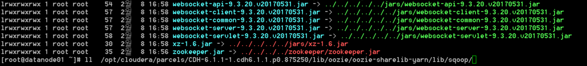

# Week7
## Hadoop Permission Configuration
#### Permission 별 기능 조사(Hue)
### Group별 권한 부여 테스트


### 201904_admin_seminar_exercise
#### Creating a Hadoop Cluster
호스트 별 역할 할당


* Host Monitor Storage Dir
/var/log/cloudera-host-monitor

* Service Monitor Storage Dir
 /var/log/cloudera-servicemonitor

#### check running CDH daemon
```
$ sudo ps -ef | grep NAMENODE
```

#### hdfs 운영 방식 3가지
* 로컬에서만 운영(개발자용)
* 하나의 서버에서 운영(sandbox 등)
* 풀스택(각 호스트들에 서버를 구축하여 운영)

hdfs에서 safemode가 되면 readonly 상태가 된다.

---


## Install NiFi and create the following dataflows
* Get data from an OPC-UA server
* Get data from an Oracle RDBMS server that is acting as the SCADA database

### HDP sandbox download link
https://www.cloudera.com/downloads/hortonworks-sandbox/hdp.html

#### install Complete


#### Web SHELL CLIENT
* maven 설치
* mvn -v 로 설치 완료 확인
* pom.xml이 위치하고 있는 곳에서 해당 명령어 실행 시 jar 파일 생성
```
$ mvn package
```

#### Nifi-OPC UA 추가
 
nifi-opcua-bundle 폴더에서 $ mvn package를 입력한다.<br>
maven으로 build한 결과
maven 설치 전 maven 버전 확인 必(3.1 이상)
 

Nifi-opcua-bundle-nar 폴더의 target 폴더에 들어가면 Nar 파일이 생성되어 있다. 해당 nar 파일을 /usr/hdf/3.1.2.0-7/nifi/lib/에 copy하면 완료
* 참고사항 : hdf sandbox 기준 경로이다.

참고 Git-Hub 주소
https://github.com/hashmapinc/nifi-opcua-bundle

#### Kerberos HDFS distcp 중 oozie 루트 접근 방법 조사
해결책 : jar 파일의 링크 경로를 알아내어 해당 링크를 oozie share lib에도 걸어준다.

