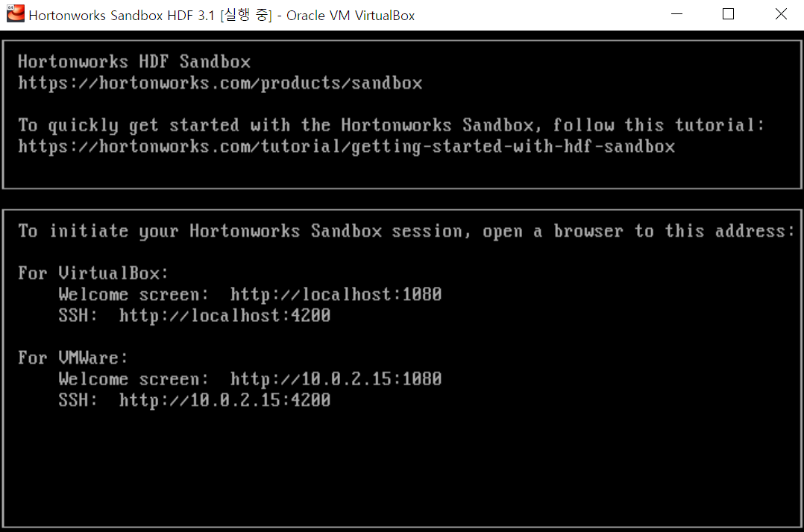

# Week7

## Hadoop Permission Configuration 
### Group별 권한 부여 테스트


### 201904_admin_seminar_exercise
#### Creating a Hadoop Cluster
호스트 별 역할 할당


* Host Monitor Storage Dir
/var/log/cloudera-host-monitor

* Service Monitor Storage Dir
 /var/log/cloudera-servicemonitor

#### check running CDH daemon
```
$ sudo ps -ef | grep NAMENODE
```
---
## Install NiFi and create the following dataflows
* Get data from an OPC-UA server
* Get data from an Oracle RDBMS server that is acting as the SCADA database

### HDP sandbox download link
https://www.cloudera.com/downloads/hortonworks-sandbox/hdp.html

#### install Complete



#### Web SHELL CLIENT
* maven 설치
* mvn -v 로 설치 완료 확인
* pom.xml이 위치하고 있는 곳에서 해당 명령어 실행 시 jar 파일 생성
```
$ mvn package
```
