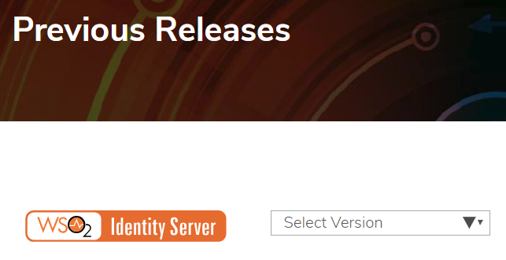
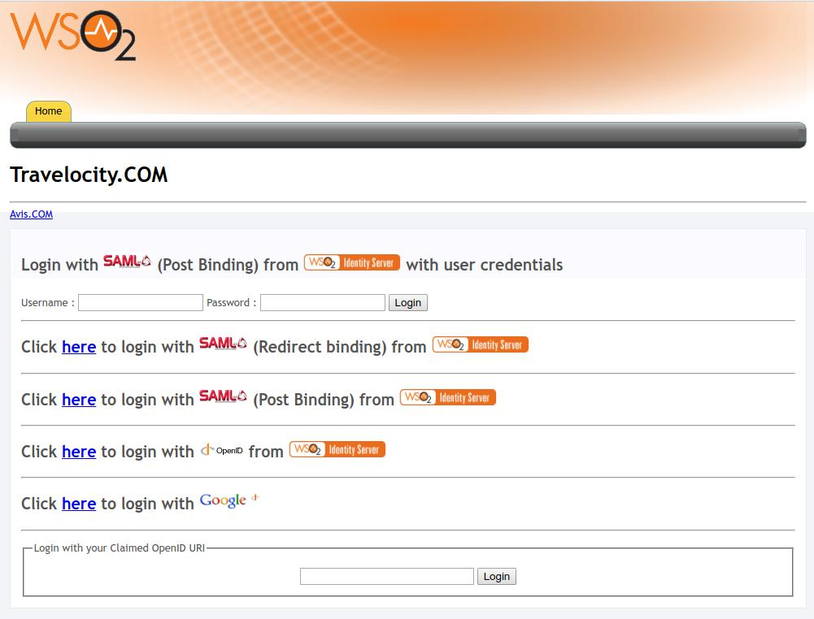

# Week8

## hynix 4/23 ~ 4/24

## WSO2 SSO

## shibboleth Server install
* install shibboleth
* cloudera hue sso

shibboleth이 hue sso 튜토리얼에서 도입된 idp 서버로 나와있어서 구축해보았음. 하지만 대부분의 사용법들이 xml 인자값들을 고치며 설정값들을 변경하여야 하여 어려움이 많았음.

결과물(shibboleth 서버 구축 완료 페이지, hue sso 구축 페이지 등)은 없고, shibboleth을 윈도우 환경, 리눅스 환경에 구축 후에 사용방법에 대한 연구를 하였음.

## WSO2 Identity Server install
* install URL
* travelocity tutorial
* Download WSO2 metadata

### install URL
```
https://wso2.com/identity-and-access-management/previous-releases/
```


### travelocity tutorial


### Google SSO result(demo)
