# Week9

## CLOUDERA SSO Configuration
### WSO2 Identity Server install
install 부분은 저번 주 내용과 중복되지만 나중에 보기 편하기 위해 첨부합니다.
* install URL
* install complete check
* Download WSO2 metadata

#### Identity server install URL
```
https://wso2.com/identity-and-access-management/previous-releases/
```
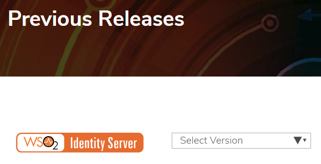

#### Identity server Install complete check
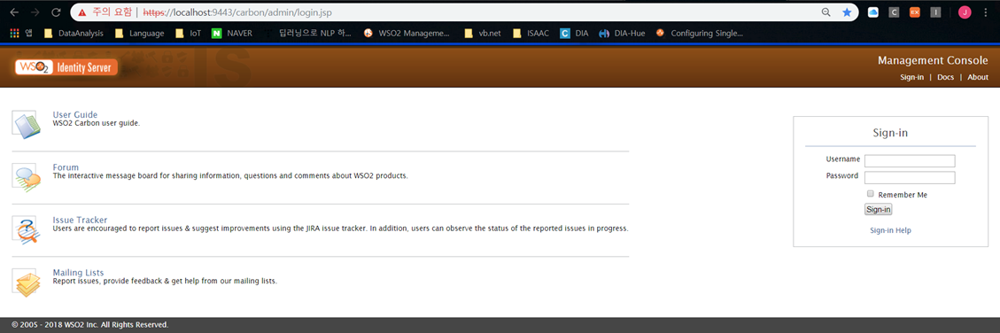

#### Download WSO2 metadata
```
https://localhost:9443/identity/metadata/saml2
```
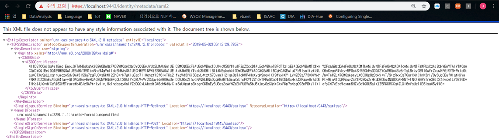

해당 내용을 xml 파일로 저장한다. 이름은 임의대로 지정 가능

### Cloudera SSO Configuration
#### CM External Authentication Configuration
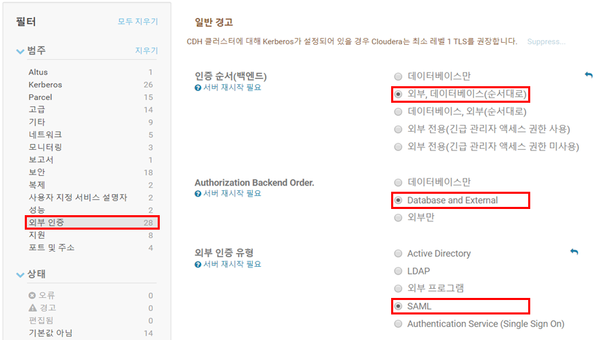
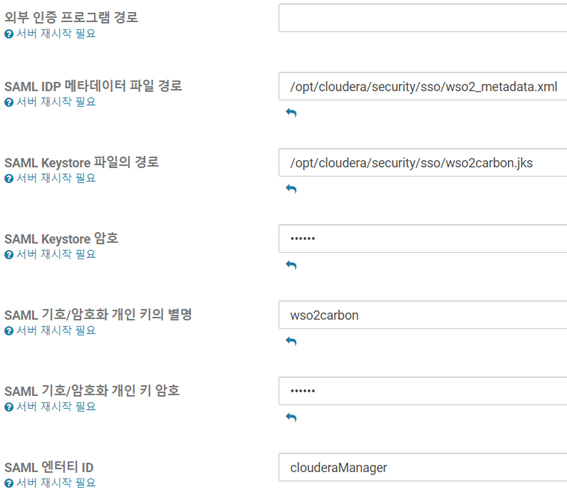

1. 메타데이터 경로는 임의대로 지정해도 되지만, 지정된 곳에 메타데이터는 반드시 WSO2에서 다운로드 받은 메타데이터가 위치해야 한다.

2. Jks 파일을 넣어야 한다. .key 파일은 인식이 안됨.
이 문제는 openssl과 keytool 사용법을 익히면 해결될 것 같다.

3. 해당 테스트에서는 keystore를 직접 생성하여 암호 및 private key를
지정하여 CM 설정에 등록하였다.
Keystore 생성 방법은 아래 링크 참고<br>
https://glassonionblog.wordpress.com/2017/01/09/extract-key-and-crt-files-from-jks-file/

SAML Entity ID 부터는 설정되어 있는 기본값으로 진행

#### Create Keystore File
CM 외부인증 설정 페이지에서 설정된 메타데이터 위치<br>
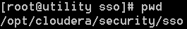

#### WSO2 jks file to key,der, pfx files
jks to der
```
$ keytool -export -alias wso2carbon -file wso2carbon.der -keystore wso2carbon.jks
```
der to crt
```
$ openssl x509 -inform der -in wso2carbon.der -out wso2carbon.crt
```
jks to p12
```
$ keytool -importkeystore -srckeystore wso2carbon.jks -destkeystore keystore.p12 -deststoretype PKCS12
```
p12 to key
```
$ openssl pkcs12 -in keystore.p12 -nodes -nocerts -out wso2carbon.key
```
p12 to pem(인증서만)
```
$ openssl pkcs12 -in keystore.p12 -out crt.pem -clcerts -nokeys
```
crt to pfx
```
$ openssl pkcs12 -export -in wso2carbon.crt -inkey wso2carbon.key -name "wso2carbon" -out wso2carbon.pfx
```
pfx to jks(인증된 키파일(최종))
```
$ keytool -importkeystore -srckeystore wso2carbon.pfx -srcstoretype pkcs12 -destkeystore wso2carbon.jks -deststoretype JKS
```
#### WSO2 jks file to pem file
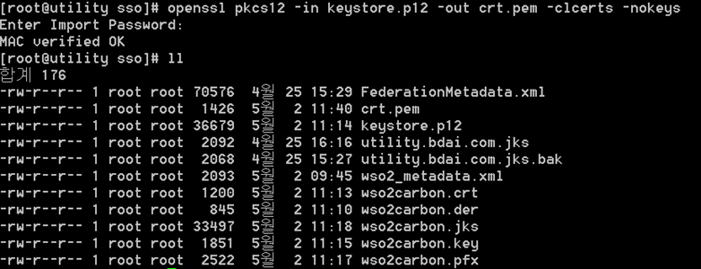

#### Download Cloudera Manager metadata
Go to IPaddress:7180/saml/metadata
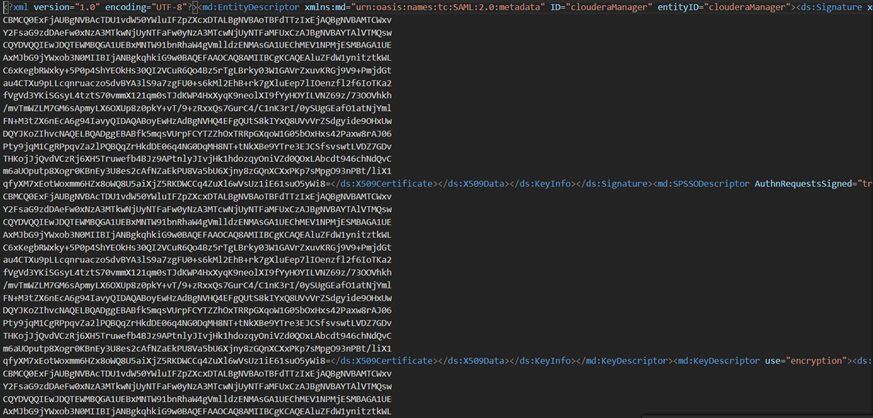

#### Certification File Upload
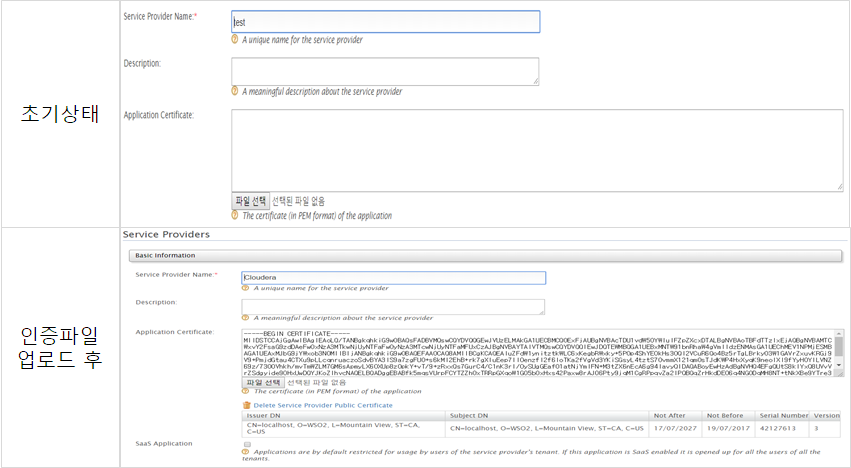

#### Cloudera Manager metadata File Upload
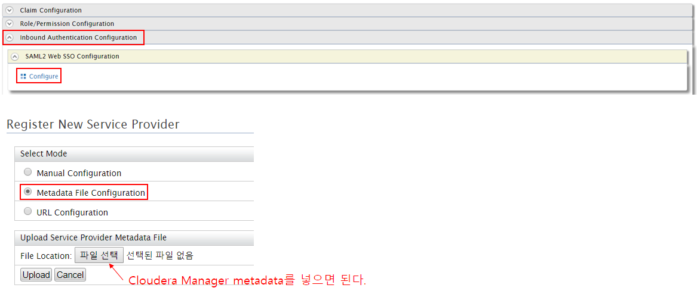
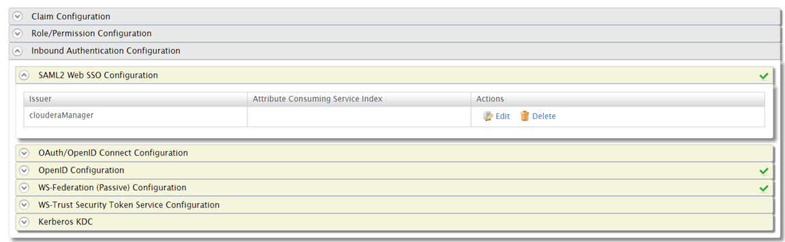

### WSO2 Configuration
#### Cloudera Manager metadata File Upload
Cloudera metadata 세부 내용(전부 자동 입력되어 있는 내용)
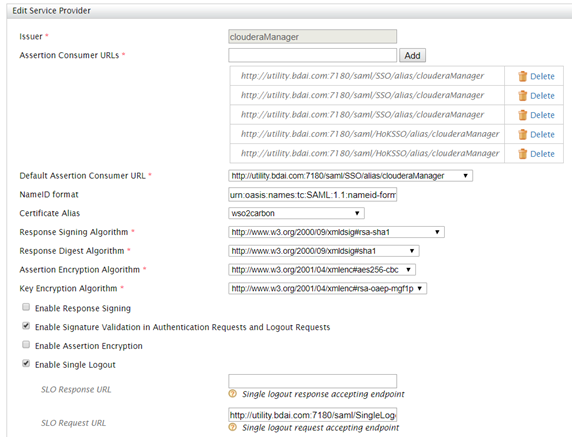

#### SSO complete check
Login Page
CM이 설치된 경로로 접속
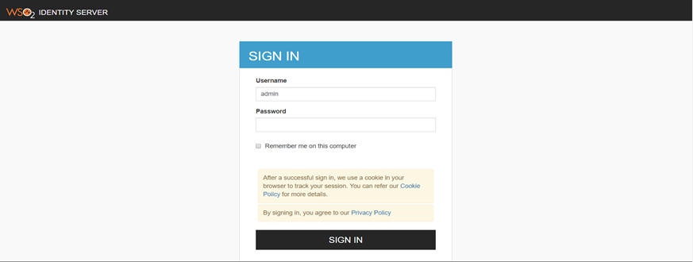
Admin에 대한 권한부여 문제는 WSO2와 Cloudera 둘 다에 권한이 필요한 부분으로 해당 demo에서는 기본값으로 진행하였음

해당 페이지가 뜨면 WSO2의 identity server와 cloudera server의 메타데이터가
정상적으로 인식되었다고 말할 수 있다.

#### CM Home Page

Admin에 대한 페이지 조회 권한이 없어서 클러스터가 보이지 않는다고 뜬다.(정상적으로 접속됨)
